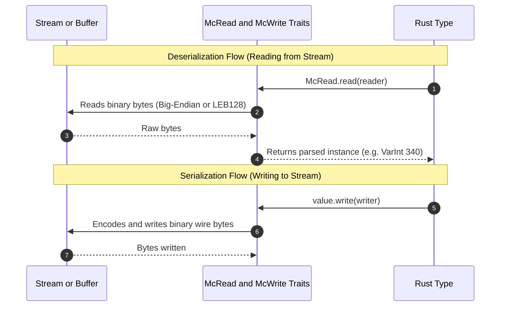

# Composable Binary Codecs: McRead and McWrite

When I first started parsing packets, my initial approach was writing one-off functions and slicing byte arrays with manual offsets like `&buf[0..2]` and `&buf[2..6]`.

That quickly got confusing. If an offset is off by one byte, you end up spending an hour trying to figure out why a port number came out as garbage.

Instead of writing custom parsing code for each packet, we can use two small traits across the whole project: `McRead` and `McWrite`.

---

## The Trait Definitions

In `src/types/traits.rs`, we define the read and write methods:

```rust
use std::io::{Read, Write};
use crate::error::MineError;

/// Trait for decoding Minecraft data types from any byte reader.
pub trait McRead: Sized {
    fn read<R: Read>(reader: &mut R) -> Result<Self, MineError>;
}

/// Trait for encoding Minecraft data types into any byte writer.
pub trait McWrite {
    fn write<W: Write>(&self, writer: &mut W) -> Result<(), MineError>;
}
```

Because `read` and `write` are generic over `std::io::Read` and `std::io::Write`, they work with sockets (`TcpStream`), in-memory buffers (`Cursor<&[u8]>`), and `Vec<u8>` buffers in unit tests.



---

## The Newtype Pattern for VarInt

A regular 32-bit integer (`i32`) in Rust naturally serializes as 4 fixed Big-Endian bytes. But in Minecraft, many integers need to be encoded as variable-length `VarInt`s.

To separate fixed-width integers from variable-length integers, we wrap `i32` in a tuple struct:

```rust
#[derive(Debug, Default, Clone, Copy, PartialEq, Eq, PartialOrd, Ord, Hash)]
pub struct VarInt(pub i32);

#[derive(Debug, Default, Clone, Copy, PartialEq, Eq, PartialOrd, Ord, Hash)]
pub struct VarLong(pub i64);
```

Now we can implement `McRead` and `McWrite` specifically for `VarInt`:

```rust
impl McRead for VarInt {
    #[inline]
    fn read<R: Read>(reader: &mut R) -> Result<Self, MineError> {
        let val = read_varint(reader)?;
        Ok(VarInt(val))
    }
}

impl McWrite for VarInt {
    #[inline]
    fn write<W: Write>(&self, writer: &mut W) -> Result<(), MineError> {
        encode_varint(self.0, writer)?;
        Ok(())
    }
}
```

To avoid typing `.0` everywhere, we implement `Deref` and `From`:

```rust
impl std::ops::Deref for VarInt {
    type Target = i32;

    #[inline]
    fn deref(&self) -> &Self::Target {
        &self.0
    }
}

impl From<i32> for VarInt {
    #[inline]
    fn from(val: i32) -> Self {
        Self(val)
    }
}
```

Now we can dereference `VarInt` like a normal integer:
```rust
let proto = VarInt(340);
if *proto == 340 {
    // Works as expected
}
```

---

## Implementing Codecs for Standard Types

Here is how we implement the traits for basic types:

### Booleans
A boolean is a single byte (`1` for `true`, `0` for `false`):

```rust
impl McRead for bool {
    #[inline]
    fn read<R: Read>(reader: &mut R) -> Result<Self, MineError> {
        let byte = u8::read(reader)?;
        Ok(byte != 0)
    }
}

impl McWrite for bool {
    #[inline]
    fn write<W: Write>(&self, writer: &mut W) -> Result<(), MineError> {
        let byte = if *self { 1u8 } else { 0u8 };
        byte.write(writer)
    }
}
```

### Fixed-Width Numbers
For `u16`, `i32`, `f64`, etc., we use Big-Endian byte arrays:

```rust
impl McRead for u16 {
    #[inline]
    fn read<R: Read>(reader: &mut R) -> Result<Self, MineError> {
        let mut buf = [0u8; 2];
        reader.read_exact(&mut buf)?;
        Ok(u16::from_be_bytes(buf))
    }
}

impl McWrite for u16 {
    #[inline]
    fn write<W: Write>(&self, writer: &mut W) -> Result<(), MineError> {
        writer.write_all(&self.to_be_bytes())?;
        Ok(())
    }
}
```

### Strings
For `String` and `&str`, we write the byte length as a `VarInt`, followed by the UTF-8 bytes:

```rust
impl McWrite for String {
    #[inline]
    fn write<W: Write>(&self, writer: &mut W) -> Result<(), MineError> {
        let bytes = self.as_bytes();
        VarInt(bytes.len() as i32).write(writer)?;
        writer.write_all(bytes)?;
        Ok(())
    }
}
```

---

## Sequential Reading

When decoding a packet with multiple fields (like a Handshake with protocol version, server address, port, and next state), we read the fields in sequence:

```rust
let protocol_version = VarInt::read(reader)?;
let server_address   = String::read(reader)?;
let server_port      = u16::read(reader)?;
let next_state       = VarInt::read(reader)?;
```

If any field fails or the stream ends early, the `?` operator returns the error immediately.
