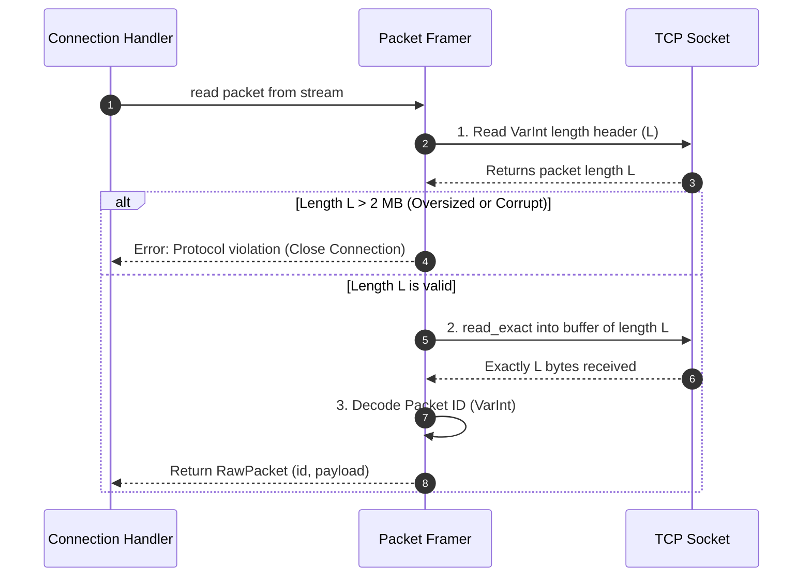

# Demystifying TCP & Stream Framing

Coming from web development or REST APIs, it is natural to think of network communication as discrete messages: you send a request, you get a response.

When I first opened a raw TCP socket for this project, I assumed that calling `read()` on the socket would give me the exact packet that the Minecraft client sent.

TCP does not work like that. TCP has no built-in concept of packets or messages. It is simply a continuous stream of bytes.

---

## Why TCP is a Stream

TCP guarantees that bytes sent over a connection arrive in order and without corruption. But it does not preserve message boundaries.

When the client writes data to its socket, the operating system splits that data into chunks based on network buffers and packet sizes.

If a client sends two packets in a row (Packet A with 10 bytes and Packet B with 25 bytes), calling `reader.read(&mut buffer)` on our server might give us:

- All 35 bytes in a single `read()` call (packet coalescing)
- 4 bytes of Packet A, followed by the rest of Packet A and part of Packet B in the next read (packet fragmentation)
- Exactly one packet, if the timing happens to match

If we assume that each `read()` returns one complete packet, our parser quickly gets out of sync, misinterprets payload bytes as packet IDs, and the connection drops.

---

## Length-Prefixed Framing

Because TCP does not mark message boundaries, application protocols have to define their own framing.

HTTP/1.1 uses text delimiters like `\r\n\r\n` and a `Content-Length` header. Minecraft uses **length-prefixed binary framing**. Every packet has this layout on the wire:

```text
+-------------------------+---------------------+-------------------------+
|  Packet Length (VarInt) |  Packet ID (VarInt) |   Packet Payload Bytes  |
+-------------------------+---------------------+-------------------------+
|<------------------- Total Length = ID bytes + Payload bytes ----------->|
```

- **Packet Length**: A variable-length integer (`VarInt`) specifying the size in bytes of the rest of the packet (the Packet ID plus the Payload).
- **Packet ID**: A `VarInt` identifying the packet type (such as `0x00` for Handshake).
- **Packet Payload**: The packet fields (coordinates, strings, player IDs, etc.).

---

## How We Read a Framed Packet

To read a packet out of the stream reliably, we follow four steps:



1. **Read the Length Header**: We decode the first `VarInt` from the stream. Because a `VarInt` uses its highest bit to signal continuation, we can read it byte-by-byte from the stream until we reach the terminating byte.
2. **Check the Size Limit**: To prevent memory exhaustion from corrupt or malicious clients, we ensure the length does not exceed 2 MB:
   ```rust
   pub const MAX_PACKET_SIZE: usize = 2 * 1024 * 1024; // 2 MB
   ```
3. **Read Exactly L Bytes**: We allocate a buffer of length $L$ and call `reader.read_exact(&mut buf)`. Unlike `read()`, `read_exact()` blocks until the buffer is completely filled. If the client disconnects before sending all bytes, it returns `UnexpectedEof`.
4. **Extract the Packet ID and Payload**: We wrap the buffer in a `std::io::Cursor`, decode the `Packet ID`, and the remaining slice becomes the payload.

---

## Writing Framed Packets

Sending a packet uses the reverse process:

1. We serialize the packet fields into a `Vec<u8>`.
2. We calculate the total length: `varint_size(id) + payload.len()`.
3. We write the total length as a `VarInt`.
4. We write the packet ID as a `VarInt`.
5. We write the payload bytes.
6. We call `writer.flush()` so the operating system dispatches the bytes over the network immediately.
