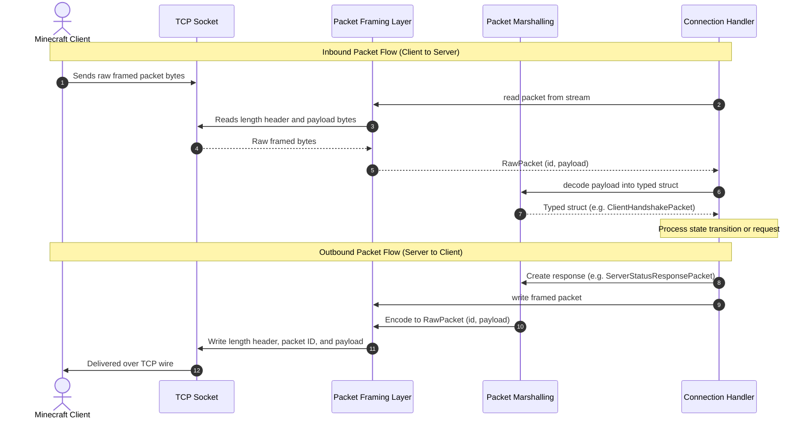

# Project Architecture Overview

Before we start building the individual packets and handlers, let's look at how the project is organized as a whole.

When I started designing this server, I wanted to keep the layers very distinct and easy to understand:

1. **Transport**: Listening on a TCP port and accepting incoming sockets.
2. **Framing**: Reading the length header and turning raw bytes into distinct packet chunks.
3. **Marshalling / Types**: Converting those raw byte chunks into strongly typed Rust structs.
4. **State Machine**: Keeping track of what phase each player is in (Handshaking, Status, Login, Play) and replying with the right packets.

---

## Directory & Module Hierarchy

The project is structured as a dual binary and library crate:

```text
mine/
├── Cargo.toml
├── src/
│   ├── main.rs            # Entry point: reads PORT and starts server
│   ├── lib.rs             # Public library facade & exports
│   ├── error.rs           # Unified error handling (MineError)
│   ├── server.rs          # Multi-threaded TCP listener
│   ├── connection.rs      # Client connection state machine
│   ├── types/             # Binary codecs & Minecraft primitives
│   │   ├── mod.rs
│   │   ├── traits.rs      # McRead & McWrite traits
│   │   ├── varint.rs      # VarInt / VarLong LEB128 encoding
│   │   ├── primitives.rs  # bool, integers, floats
│   │   └── strings.rs     # Bounded UTF-8 strings
│   └── packet/            # Typed Minecraft packets
│       ├── mod.rs         # RawPacket & Packet trait
│       ├── handshake.rs   # ClientHandshakePacket (0x00)
│       ├── status.rs      # ClientStatusRequest, ServerStatusResponse, ClientPing, ServerPong
│       ├── login.rs       # ClientLoginStart, ServerLoginSuccess, ServerLoginDisconnect
│       └── play.rs        # ServerJoinGame, ServerPlayerPositionAndLook, KeepAlive
└── tests/                 # Integration tests with real TCP sockets
    ├── framing_test.rs
    ├── types_test.rs
    ├── varint_test.rs
    └── server_test.rs
```

---

## The Request-Response Pipeline

Here is how data flows in and out of the server for every packet:



1. **Inbound**:
   - `RawPacket::read(&mut stream)` reads the length header and pulls the raw packet bytes off the wire.
   - We inspect `raw.id` in the context of the player's current `ConnectionState`.
   - `Packet::from_raw(&raw)` parses the payload into a typed struct (e.g. `ClientHandshakePacket`).
   - The connection updates its state or prepares a reply.

2. **Outbound**:
   - We create a response struct (e.g. `ServerStatusResponsePacket`).
   - `packet.write_framed(&mut stream)` serializes it, adds the packet ID and `VarInt` length header, and sends it over the socket.

---

## Why I Chose Thread-Per-Connection

When choosing how to handle multiple connected clients, a common option in Rust is to use an asynchronous runtime like `tokio`.

However, since this was my first time diving into network sockets and my goal was to learn how everything works under the hood, I decided to use the standard library's **Thread-Per-Connection model** with `std::thread`:

```rust
for stream in listener.incoming() {
    match stream {
        Ok(stream) => {
            let entity_id = self.entity_counter.fetch_add(1, Ordering::SeqCst);
            thread::spawn(move || {
                let mut conn = Connection::new(stream, entity_id);
                if let Err(e) = conn.handle() {
                    eprintln!("Connection ended: {e}");
                }
            });
        }
        Err(e) => eprintln!("Error accepting connection: {e}"),
    }
}
```

### Why this worked well for learning:

- **Straightforward logic**: Code executes linearly from top to bottom. No `async`/`await` state machines or complex pinning.
- **Independent execution**: Each player connection runs on its own OS thread without blocking other players.
- **Simple socket timeouts**: We can set timeouts directly on the socket with `stream.set_read_timeout()`, which makes our keep-alive heartbeat loop easy to implement.
- **Zero external dependencies**: Everything comes right out of the standard library.

In the next chapter, we'll look at how we turn raw packet IDs into typed Rust structs.
