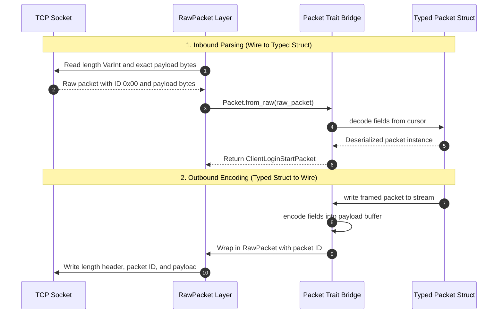

# The Packet System & Wire Marshalling

In the Minecraft protocol, packet IDs are reused across different states. For example, packet ID `0x00` means something different depending on the connection state:

| State       | Packet ID `0x00`              |
| ----------- | ----------------------------- |
| Handshaking | `ClientHandshakePacket`       |
| Status      | `ClientStatusRequestPacket`   |
| Login       | `ClientLoginStartPacket`      |
| Play        | `ClientTeleportConfirmPacket` |

To handle this cleanly, we split packet processing into two layers:

1. `RawPacket`: The raw wire representation with an integer ID and a byte payload.
2. `Packet` trait: A trait implemented by typed structs for encoding and decoding.



---

## The RawPacket Layer

`RawPacket` represents a framed packet before field parsing:

```rust
#[derive(Debug, Clone, PartialEq, Eq)]
pub struct RawPacket {
    pub id: i32,
    pub payload: Vec<u8>,
}
```

### Reading from the Wire

`RawPacket::read` reads the VarInt length prefix, pulls the bytes, and extracts the packet ID:

```rust
pub fn read<R: Read>(reader: &mut R) -> Result<Self, MineError> {
    let packet_len = read_varint(reader)?;
    if packet_len <= 0 {
        return Err(MineError::Protocol(format!("Invalid packet length: {packet_len}")));
    }

    let packet_len = packet_len as usize;
    if packet_len > MAX_PACKET_SIZE {
        return Err(MineError::Protocol(format!(
            "Packet length ({packet_len}) exceeds maximum permitted ({MAX_PACKET_SIZE})"
        )));
    }

    let mut packet_buf = vec![0u8; packet_len];
    reader.read_exact(&mut packet_buf)?;

    let mut cursor = Cursor::new(&packet_buf);
    let id = read_varint(&mut cursor)?;
    let id_bytes_read = cursor.position() as usize;

    let payload = packet_buf[id_bytes_read..].to_vec();
    Ok(RawPacket { id, payload })
}
```

### Writing to the Wire

`RawPacket::write` calculates the total length, writes the length prefix and packet ID as `VarInt`s, writes the payload, and flushes:

```rust
pub fn write<W: Write>(&self, writer: &mut W) -> Result<(), MineError> {
    let id_size = varint_size(self.id);
    let total_len = id_size + self.payload.len();

    encode_varint(total_len as i32, writer)?;
    encode_varint(self.id, writer)?;
    writer.write_all(&self.payload)?;
    writer.flush()?;

    Ok(())
}
```

---

## The Packet Trait

In `src/packet/mod.rs`, we define the `Packet` trait:

```rust
pub trait Packet: Sized {
    const PACKET_ID: i32;

    fn decode<R: Read>(reader: &mut R) -> Result<Self, MineError>;
    fn encode<W: Write>(&self, writer: &mut W) -> Result<(), MineError>;

    fn to_raw(&self) -> Result<RawPacket, MineError> {
        let mut payload = Vec::new();
        self.encode(&mut payload)?;
        Ok(RawPacket::new(Self::PACKET_ID, payload))
    }

    fn from_raw(raw: &RawPacket) -> Result<Self, MineError> {
        if raw.id != Self::PACKET_ID {
            return Err(MineError::InvalidPacketId(raw.id));
        }
        let mut cursor = raw.payload_cursor();
        Self::decode(&mut cursor)
    }

    fn write_framed<W: Write>(&self, writer: &mut W) -> Result<(), MineError> {
        let raw = self.to_raw()?;
        raw.write(writer)
    }

    fn read_framed<R: Read>(reader: &mut R) -> Result<Self, MineError> {
        let raw = RawPacket::read(reader)?;
        Self::from_raw(&raw)
    }
}
```

---

## Implementing a Packet Struct

Here is how `ClientLoginStartPacket` looks with the trait:

```rust
#[derive(Debug, Clone, PartialEq, Eq)]
pub struct ClientLoginStartPacket {
    pub username: String,
}

impl Packet for ClientLoginStartPacket {
    const PACKET_ID: i32 = 0x00;

    fn decode<R: Read>(reader: &mut R) -> Result<Self, MineError> {
        let username = read_string_bounded(reader, 16)?;
        Ok(Self { username })
    }

    fn encode<W: Write>(&self, writer: &mut W) -> Result<(), MineError> {
        self.username.write(writer)
    }
}
```

Because default methods provide `read_framed` and `write_framed`, we can read or write packets directly against streams:

```rust
// Reading from socket:
let login_start = ClientLoginStartPacket::read_framed(&mut stream)?;

// Writing to socket:
ServerLoginSuccessPacket::generate_offline("Steve").write_framed(&mut stream)?;
```
