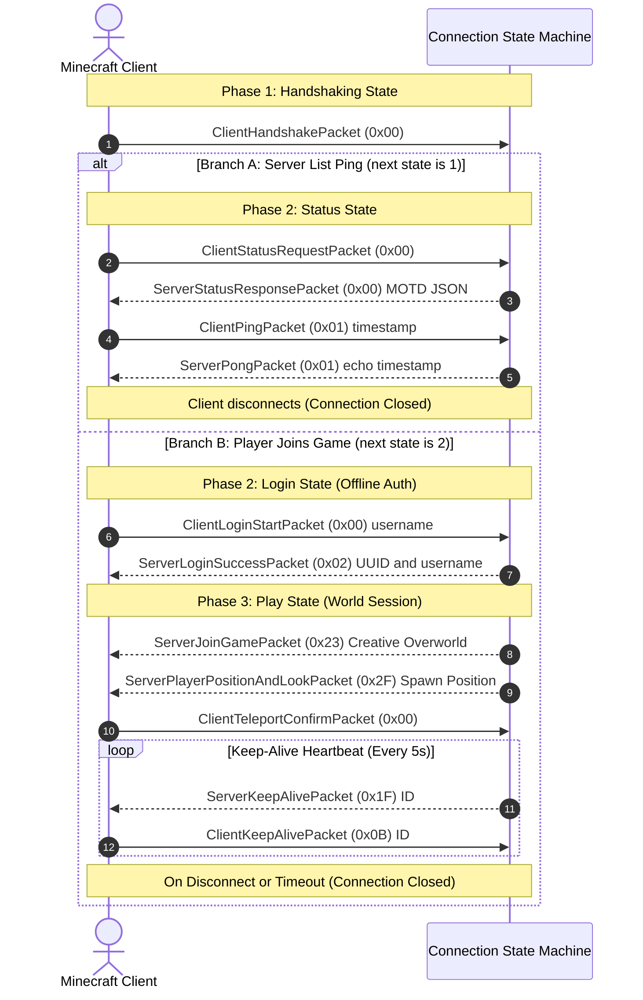

# Connection Lifecycle & The State Machine

When a client connects to our server, the connection moves through distinct states depending on what the player is doing in their game client.

---

## The Four Protocol States

In `src/connection.rs`, we represent these states with the `ConnectionState` enum:

```rust
#[derive(Debug, Clone, Copy, PartialEq, Eq)]
pub enum ConnectionState {
    Handshaking,
    Status,
    Login,
    Play,
    Closed,
}
```



---

## 1. Handshaking State

Every connection begins in `Handshaking`. The client sends a single `ClientHandshakePacket` (`0x00`) with:

- `protocol_version`: 340 for Minecraft 1.12.2
- `server_address`: the hostname the client connected to
- `server_port`: the port (usually 25565)
- `next_state`: 1 for Status (server browser), 2 for Login (joining the game)

If `next_state` is 1, we switch to `Status`. If 2, we switch to `Login`. Any other value closes the connection.

---

## 2. Status State (Server List Ping)

The client queries the server to show the MOTD, player count, and ping in the multiplayer list:

1. Status Request (`0x00`): the client asks for server info (`ClientStatusRequestPacket`).
2. Status Response (`0x00`): the server replies with a JSON payload containing version info, player counts, and MOTD text (`ServerStatusResponsePacket`).
3. Ping (`0x01`): the client sends an `i64` timestamp payload (`ClientPingPacket`).
4. Pong (`0x01`): the server echoes the exact same timestamp back so the client can calculate ping time (`ServerPongPacket`).
5. The client closes the socket after receiving the Pong.

---

## 3. Login State (Offline Mode)

When a player clicks "Join Server", the connection enters `Login`:

1. Login Start (`0x00`): the client sends their username (up to 16 characters) (`ClientLoginStartPacket`).
2. We generate an offline UUID from the username.
3. Login Success (`0x02`): we send back the UUID string and username (`ServerLoginSuccessPacket`).
4. The state switches to `Play`.

---

## 4. Play State (Game Loop & Heartbeats)

Once in `Play`:

1. We send `ServerJoinGamePacket` (`0x23`) with entity ID, gamemode, and dimension.
2. We send `ServerPlayerPositionAndLookPacket` (`0x2F`) with initial coordinates to clear the loading screen.
3. We send a `ServerKeepAlivePacket` (`0x1F`) every 5 seconds so the client does not time out.
4. We read incoming packets from the client (such as position updates and chat) and drain them so the TCP stream remains synchronized.

---

## The Driver Loop

The connection loop in `src/connection.rs` matches on the current state:

```rust
pub fn handle(&mut self) -> Result<(), MineError> {
    while self.state != ConnectionState::Closed {
        match self.state {
            ConnectionState::Handshaking => self.handle_handshaking()?,
            ConnectionState::Status => self.handle_status()?,
            ConnectionState::Login => self.handle_login()?,
            ConnectionState::Play => self.handle_play()?,
            ConnectionState::Closed => break,
        }
    }
    Ok(())
}
```

If any handler hits a stream disconnect (`UnexpectedEof`) or unrecoverable error, it sets `self.state = ConnectionState::Closed` and exits cleanly.
