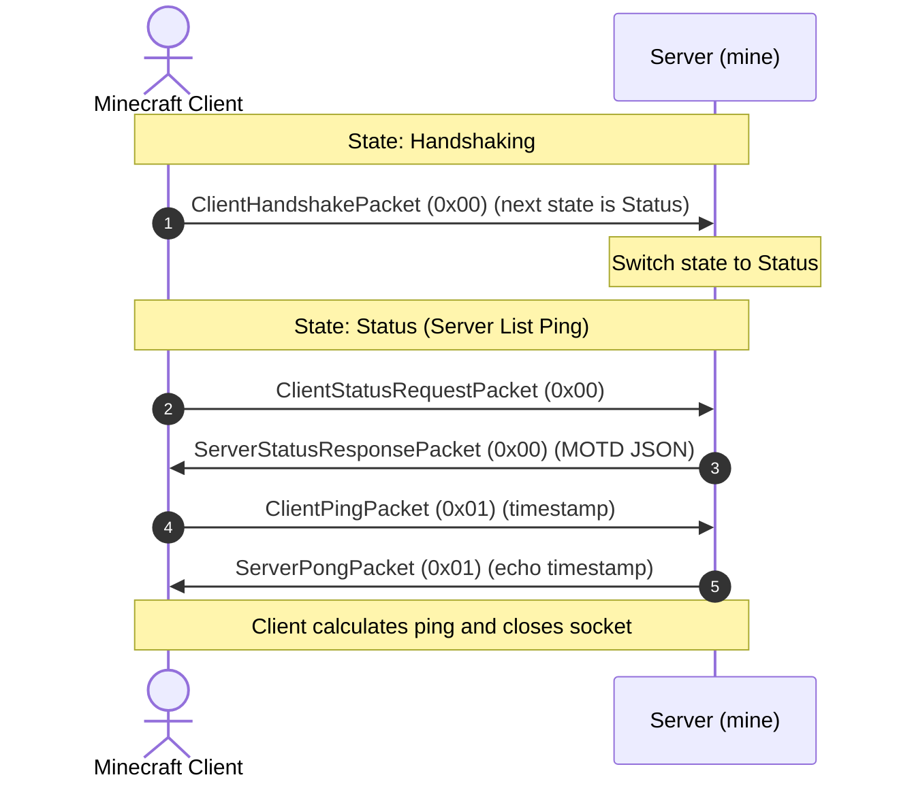

# Step 3: Handshaking & Server List Ping

When you add a server address like `localhost:25565` to your multiplayer menu, Minecraft does not connect to the world right away.

Instead, the client performs Server List Ping (SLP) to fetch the server's MOTD, protocol version, player counts, and latency.



---

## 1. The Handshake Packet

The client initiates the connection by sending a `ClientHandshakePacket`. In `src/packet/handshake.rs`:

```rust
// src/packet/handshake.rs
use std::io::{Read, Write};
use crate::error::MineError;
use crate::packet::Packet;
use crate::types::{read_string_bounded, McRead, McWrite, VarInt};

#[derive(Debug, Clone, PartialEq, Eq)]
pub struct ClientHandshakePacket {
    pub protocol_version: VarInt,
    pub server_address: String,
    pub server_port: u16,
    pub next_state: VarInt,
}

impl Packet for ClientHandshakePacket {
    const PACKET_ID: i32 = 0x00;

    fn decode<R: Read>(reader: &mut R) -> Result<Self, MineError> {
        let protocol_version = VarInt::read(reader)?;
        let server_address = read_string_bounded(reader, 255)?;
        let server_port = u16::read(reader)?;
        let next_state = VarInt::read(reader)?;

        Ok(Self {
            protocol_version,
            server_address,
            server_port,
            next_state,
        })
    }

    fn encode<W: Write>(&self, writer: &mut W) -> Result<(), MineError> {
        self.protocol_version.write(writer)?;
        self.server_address.write(writer)?;
        self.server_port.write(writer)?;
        self.next_state.write(writer)?;
        Ok(())
    }
}
```

---

## 2. Status & Ping Packets

In `src/packet/status.rs`, we define the status query and ping packets:

```rust
// src/packet/status.rs
use std::io::{Read, Write};
use crate::error::MineError;
use crate::packet::Packet;
use crate::types::{McRead, McWrite};

/// Client requests the MOTD JSON payload (Packet ID: 0x00)
#[derive(Debug, Clone, PartialEq, Eq, Default)]
pub struct ClientStatusRequestPacket;

impl Packet for ClientStatusRequestPacket {
    const PACKET_ID: i32 = 0x00;
    fn decode<R: Read>(_reader: &mut R) -> Result<Self, MineError> { Ok(Self) }
    fn encode<W: Write>(&self, _writer: &mut W) -> Result<(), MineError> { Ok(()) }
}

/// Server responds with JSON status (Packet ID: 0x00)
#[derive(Debug, Clone, PartialEq, Eq)]
pub struct ServerStatusResponsePacket {
    pub json_response: String,
}

impl ServerStatusResponsePacket {
    pub fn new(json_response: impl Into<String>) -> Self {
        Self { json_response: json_response.into() }
    }

    pub fn create_default(motd: &str, max_players: i32, online_players: i32) -> Self {
        let json = format!(
            r#"{{"version":{{"name":"1.12.2","protocol":340}},"players":{{"max":{max_players},"online":{online_players},"sample":[]}},"description":{{"text":"{motd}"}}}}"#
        );
        Self::new(json)
    }
}

impl Packet for ServerStatusResponsePacket {
    const PACKET_ID: i32 = 0x00;

    fn decode<R: Read>(reader: &mut R) -> Result<Self, MineError> {
        let json_response = String::read(reader)?;
        Ok(Self { json_response })
    }

    fn encode<W: Write>(&self, writer: &mut W) -> Result<(), MineError> {
        self.json_response.write(writer)
    }
}

/// Client sends a 64-bit timestamp to measure latency (Packet ID: 0x01)
#[derive(Debug, Clone, PartialEq, Eq)]
pub struct ClientPingPacket {
    pub payload: i64,
}

impl Packet for ClientPingPacket {
    const PACKET_ID: i32 = 0x01;
    fn decode<R: Read>(reader: &mut R) -> Result<Self, MineError> {
        Ok(Self { payload: i64::read(reader)? })
    }
    fn encode<W: Write>(&self, writer: &mut W) -> Result<(), MineError> {
        self.payload.write(writer)
    }
}

/// Server echoes the client's timestamp (Packet ID: 0x01)
#[derive(Debug, Clone, PartialEq, Eq)]
pub struct ServerPongPacket {
    pub payload: i64,
}

impl Packet for ServerPongPacket {
    const PACKET_ID: i32 = 0x01;
    fn decode<R: Read>(reader: &mut R) -> Result<Self, MineError> {
        Ok(Self { payload: i64::read(reader)? })
    }
    fn encode<W: Write>(&self, writer: &mut W) -> Result<(), MineError> {
        self.payload.write(writer)
    }
}
```

---

## 3. Handling Status in Connection

In `src/connection.rs`:

```rust
fn handle_handshaking(&mut self) -> Result<(), MineError> {
    let raw = RawPacket::read(&mut self.stream)?;
    let handshake = ClientHandshakePacket::from_raw(&raw)?;

    match *handshake.next_state {
        1 => self.state = ConnectionState::Status,
        2 => self.state = ConnectionState::Login,
        _ => self.state = ConnectionState::Closed,
    }
    Ok(())
}

fn handle_status(&mut self) -> Result<(), MineError> {
    loop {
        let raw = match RawPacket::read(&mut self.stream) {
            Ok(pkt) => pkt,
            Err(MineError::UnexpectedEof) | Err(MineError::Io(_)) => {
                self.state = ConnectionState::Closed;
                break;
            }
            Err(e) => return Err(e),
        };

        match raw.id {
            ClientStatusRequestPacket::PACKET_ID => {
                let response = ServerStatusResponsePacket::create_default(
                    "§a§lRust 1.12.2 Server §r- Online!",
                    20,
                    0,
                );
                response.write_framed(&mut self.stream)?;
            }
            ClientPingPacket::PACKET_ID => {
                let ping = ClientPingPacket::from_raw(&raw)?;
                let pong = ServerPongPacket { payload: ping.payload };
                pong.write_framed(&mut self.stream)?;
                self.state = ConnectionState::Closed;
                break;
            }
            _ => {
                self.state = ConnectionState::Closed;
                break;
            }
        }
    }
    Ok(())
}
```

Formatting codes in the MOTD use the section sign (`§`):

- `§a`: light green
- `§l`: bold
- `§r`: reset formatting
