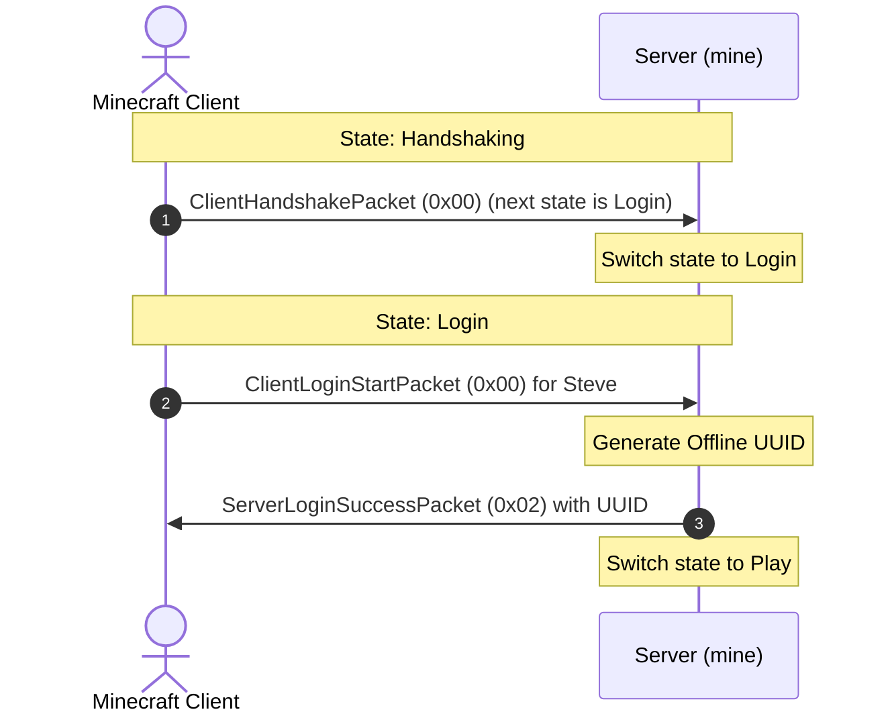

# Step 4: Player Authentication & Offline Login

When a player joins the server, the connection enters the Login phase.

---

## 1. Online vs Offline Authentication

Minecraft supports two authentication modes:

- Online Mode: The server contacts Mojang's session server (`sessionserver.mojang.com`) to verify the player's account.
- Offline Mode: The server does not contact external authentication servers. It accepts the username and computes a deterministic offline UUID.

This server runs in offline mode to avoid external network requests and third-party dependencies.



---

## 2. Defining the Login Packets

In `src/packet/login.rs`:

```rust
// src/packet/login.rs
use std::io::{Read, Write};
use crate::error::MineError;
use crate::packet::Packet;
use crate::types::{read_string_bounded, McRead, McWrite};

/// Client sends username to start login (Packet ID: 0x00 in Login State)
#[derive(Debug, Clone, PartialEq, Eq)]
pub struct ClientLoginStartPacket {
    pub username: String,
}

impl Packet for ClientLoginStartPacket {
    const PACKET_ID: i32 = 0x00;

    fn decode<R: Read>(reader: &mut R) -> Result<Self, MineError> {
        let username = read_string_bounded(reader, 16)?;
        Ok(Self { username })
    }

    fn encode<W: Write>(&self, writer: &mut W) -> Result<(), MineError> {
        self.username.write(writer)
    }
}

/// Server responds with assigned UUID and username (Packet ID: 0x02 in Login State)
#[derive(Debug, Clone, PartialEq, Eq)]
pub struct ServerLoginSuccessPacket {
    pub uuid: String,
    pub username: String,
}

impl ServerLoginSuccessPacket {
    pub fn new(uuid: impl Into<String>, username: impl Into<String>) -> Self {
        Self {
            uuid: uuid.into(),
            username: username.into(),
        }
    }

    /// Generates a standard formatted offline UUID deterministically from a username.
    pub fn generate_offline(username: &str) -> Self {
        let mut hash: u128 = 0;
        for (i, b) in username.bytes().enumerate() {
            hash = hash.wrapping_add((b as u128) << ((i % 16) * 8));
        }
        let uuid_str = format!(
            "{:08x}-{:04x}-3{:03x}-8{:03x}-{:012x}",
            (hash >> 96) as u32,
            (hash >> 80) as u16,
            (hash >> 68) as u16 & 0x0FFF,
            (hash >> 56) as u16 & 0x0FFF,
            hash as u64 & 0xFFFFFFFFFFFF
        );
        Self::new(uuid_str, username)
    }
}

impl Packet for ServerLoginSuccessPacket {
    const PACKET_ID: i32 = 0x02;

    fn decode<R: Read>(reader: &mut R) -> Result<Self, MineError> {
        let uuid = read_string_bounded(reader, 36)?;
        let username = read_string_bounded(reader, 16)?;
        Ok(Self { uuid, username })
    }

    fn encode<W: Write>(&self, writer: &mut W) -> Result<(), MineError> {
        self.uuid.write(writer)?;
        self.username.write(writer)?;
        Ok(())
    }
}
```

---

## 3. Handling Login in Connection

In `src/connection.rs`:

```rust
fn handle_login(&mut self) -> Result<(), MineError> {
    let raw = RawPacket::read(&mut self.stream)?;
    if raw.id != ClientLoginStartPacket::PACKET_ID {
        return Err(MineError::InvalidPacketId(raw.id));
    }

    let login_start = ClientLoginStartPacket::from_raw(&raw)?;
    let username = login_start.username;
    println!("[{:?}] Player logging in: {}", self.stream.peer_addr().ok(), username);

    let login_success = ServerLoginSuccessPacket::generate_offline(&username);
    login_success.write_framed(&mut self.stream)?;

    self.username = Some(username);
    self.state = ConnectionState::Play;
    Ok(())
}
```
