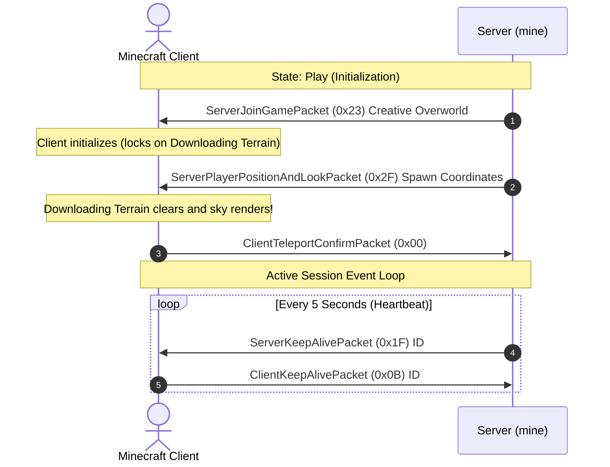

# Step 5: Spawning into the World (Play State)

This is the most exciting milestone in the entire project: transitioning from raw protocol bytes into an active game world where your player character actually spawns!

However, this step is also where I ran into one of the most frustrating bugs during development. Let's talk about the "Downloading Terrain" screen and how the Play state works.

---

## The "Downloading Terrain" Mystery

When I first got the login flow working, I immediately sent `ServerJoinGamePacket` to the client, expecting to see my player standing in the world. Instead, the Minecraft client opened a loading screen with the text:

> **"Downloading Terrain..."**

...and it sat there forever.

### What was actually happening?

When the Minecraft client receives `ServerJoinGamePacket`, it creates the internal player object and initializes its rendering engine, but it intentionally locks the screen on "Downloading Terrain". It is waiting for the server to explicitly tell it where the player is in 3D space.

The client will only dismiss the loading screen and render the sky once it receives a **`ServerPlayerPositionAndLookPacket` (ID `0x2F`)**.

Once I figured that out and sent the position packet, the loading screen instantly cleared, and the world appeared!



---

## 1. Defining the Play Packets

Create `src/packet/play.rs`:

```rust
// src/packet/play.rs
use std::io::{Read, Write};
use crate::error::MineError;
use crate::packet::Packet;
use crate::types::{read_string_bounded, McRead, McWrite, VarInt};

/// Initializes the player into the game world (ID: 0x23 in 1.12.2)
#[derive(Debug, Clone, PartialEq, Eq)]
pub struct ServerJoinGamePacket {
    pub entity_id: i32,
    pub gamemode: u8,       // 0=Survival, 1=Creative, 2=Adventure, 3=Spectator
    pub dimension: i32,     // -1=Nether, 0=Overworld, 1=End
    pub difficulty: u8,    // 0=Peaceful, 1=Easy, 2=Normal, 3=Hard
    pub max_players: u8,
    pub level_type: String, // "default", "flat"
    pub reduced_debug_info: bool,
}

impl ServerJoinGamePacket {
    pub fn default_spawn(entity_id: i32) -> Self {
        Self {
            entity_id,
            gamemode: 1, // Creative mode
            dimension: 0, // Overworld
            difficulty: 1, // Easy
            max_players: 20,
            level_type: "default".to_string(),
            reduced_debug_info: false,
        }
    }
}

impl Packet for ServerJoinGamePacket {
    const PACKET_ID: i32 = 0x23;

    fn decode<R: Read>(reader: &mut R) -> Result<Self, MineError> {
        Ok(Self {
            entity_id: i32::read(reader)?,
            gamemode: u8::read(reader)?,
            dimension: i32::read(reader)?,
            difficulty: u8::read(reader)?,
            max_players: u8::read(reader)?,
            level_type: read_string_bounded(reader, 16)?,
            reduced_debug_info: bool::read(reader)?,
        })
    }

    fn encode<W: Write>(&self, writer: &mut W) -> Result<(), MineError> {
        self.entity_id.write(writer)?;
        self.gamemode.write(writer)?;
        self.dimension.write(writer)?;
        self.difficulty.write(writer)?;
        self.max_players.write(writer)?;
        self.level_type.write(writer)?;
        self.reduced_debug_info.write(writer)?;
        Ok(())
    }
}

/// Sets player position and exits the loading screen (ID: 0x2F in 1.12.2)
#[derive(Debug, Clone, PartialEq)]
pub struct ServerPlayerPositionAndLookPacket {
    pub x: f64,
    pub y: f64,
    pub z: f64,
    pub yaw: f32,
    pub pitch: f32,
    pub flags: i8,          // 0x00 = all coordinates absolute
    pub teleport_id: VarInt,
}

impl ServerPlayerPositionAndLookPacket {
    pub fn spawn_at(x: f64, y: f64, z: f64, teleport_id: i32) -> Self {
        Self {
            x, y, z,
            yaw: 0.0,
            pitch: 0.0,
            flags: 0,
            teleport_id: VarInt(teleport_id),
        }
    }
}

impl Packet for ServerPlayerPositionAndLookPacket {
    const PACKET_ID: i32 = 0x2F;

    fn decode<R: Read>(reader: &mut R) -> Result<Self, MineError> {
        Ok(Self {
            x: f64::read(reader)?,
            y: f64::read(reader)?,
            z: f64::read(reader)?,
            yaw: f32::read(reader)?,
            pitch: f32::read(reader)?,
            flags: i8::read(reader)?,
            teleport_id: VarInt::read(reader)?,
        })
    }

    fn encode<W: Write>(&self, writer: &mut W) -> Result<(), MineError> {
        self.x.write(writer)?;
        self.y.write(writer)?;
        self.z.write(writer)?;
        self.yaw.write(writer)?;
        self.pitch.write(writer)?;
        self.flags.write(writer)?;
        self.teleport_id.write(writer)?;
        Ok(())
    }
}

/// Sent periodically by server to check client responsiveness (ID: 0x1F)
#[derive(Debug, Clone, PartialEq, Eq)]
pub struct ServerKeepAlivePacket {
    pub keep_alive_id: i64,
}

impl Packet for ServerKeepAlivePacket {
    const PACKET_ID: i32 = 0x1F;
    fn decode<R: Read>(reader: &mut R) -> Result<Self, MineError> {
        Ok(Self { keep_alive_id: i64::read(reader)? })
    }
    fn encode<W: Write>(&self, writer: &mut W) -> Result<(), MineError> {
        self.keep_alive_id.write(writer)
    }
}
```

---

## 2. The Play Loop & Keep-Alive Heartbeat

Minecraft clients will disconnect after 20 seconds if they don't receive any packets, giving a `Timed Out` error.

To keep the player connected, our server sends a `ServerKeepAlivePacket` every 5 seconds.

To avoid blocking forever on incoming data while we need to send heartbeats, we configure a **read timeout** (500ms) on the socket:

```rust
fn handle_play(&mut self) -> Result<(), MineError> {
    let player_name = self.username.clone().unwrap_or_else(|| "Player".into());
    println!("[{:?}] Spawning {player_name} (Entity ID: {})", self.stream.peer_addr().ok(), self.entity_id);

    // 1. Send Join Game
    let join_game = ServerJoinGamePacket::default_spawn(self.entity_id);
    join_game.write_framed(&mut self.stream)?;

    // 2. Send Player Position (breaks through "Downloading Terrain")
    let position = ServerPlayerPositionAndLookPacket::spawn_at(0.0, 64.0, 0.0, 1);
    position.write_framed(&mut self.stream)?;

    // 3. Set short socket timeout (500ms) so our heartbeat check runs periodically
    self.stream.set_read_timeout(Some(Duration::from_millis(500)))?;
    self.last_keep_alive = Instant::now();

    // 4. Game event loop
    while self.state == ConnectionState::Play {
        // Send Keep-Alive every 5 seconds
        if self.last_keep_alive.elapsed() >= Duration::from_secs(5) {
            self.current_keep_alive_id += 1;
            let keep_alive = ServerKeepAlivePacket {
                keep_alive_id: self.current_keep_alive_id,
            };
            if let Err(e) = keep_alive.write_framed(&mut self.stream) {
                println!("[{player_name}] Keep-Alive write failed: {e}");
                self.state = ConnectionState::Closed;
                break;
            }
            self.last_keep_alive = Instant::now();
        }

        // Read incoming packets from client
        match RawPacket::read(&mut self.stream) {
            Ok(packet) => {
                self.handle_incoming_play_packet(&packet)?;
            }
            Err(MineError::Io(err))
                if err.kind() == ErrorKind::WouldBlock || err.kind() == ErrorKind::TimedOut =>
            {
                // Timeout elapsed with no incoming client packets: continue loop to check keep-alive!
                continue;
            }
            Err(MineError::UnexpectedEof) => {
                println!("[{player_name}] Disconnected (EOF)");
                self.state = ConnectionState::Closed;
                break;
            }
            Err(err) => {
                eprintln!("[{player_name}] Connection error: {err}");
                self.state = ConnectionState::Closed;
                break;
            }
        }
    }

    println!("[{player_name}] Session ended.");
    Ok(())
}
```

When you launch Minecraft 1.12.2 and join the server, the loading screen clears, the skybox appears, and you are standing inside your very own Rust-powered Minecraft server!
