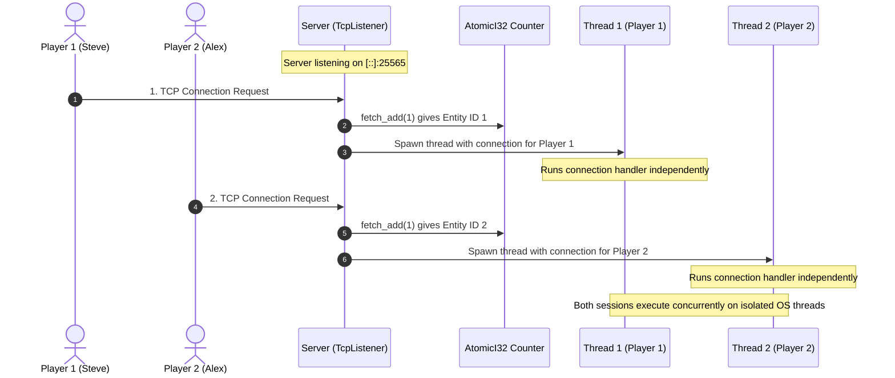

# Step 6: Multi-Client Server & Concurrency

With packet parsing and player sessions working, we now build the multi-client network listener in `src/server.rs` and the binary entry point in `src/main.rs`.

---

## 1. Dual-Stack IPv4 & IPv6 Socket Binding

On Linux and macOS, binding to `[::]:25565` opens a dual-stack socket that accepts connections from both IPv6 (`::1`) and IPv4 (`127.0.0.1` / `0.0.0.0`).

If a system has IPv6 disabled in the kernel, binding to `[::]` fails. To handle that, the server attempts `[::]:port` first and falls back to `0.0.0.0:port`.

---

## 2. Implementing Server

In `src/server.rs`:

```rust
// src/server.rs
use std::net::TcpListener;
use std::sync::atomic::{AtomicI32, Ordering};
use std::sync::Arc;
use std::thread;

use crate::connection::Connection;
use crate::error::MineError;

pub struct Server {
    bind_address: String,
    entity_counter: Arc<AtomicI32>,
}

impl Server {
    pub fn new(bind_address: impl Into<String>) -> Self {
        Self {
            bind_address: bind_address.into(),
            entity_counter: Arc::new(AtomicI32::new(1)),
        }
    }

    pub fn run(&self) -> Result<(), MineError> {
        let listener = match TcpListener::bind(&self.bind_address) {
            Ok(l) => l,
            Err(err) => {
                if self.bind_address.starts_with("[::]") {
                    let port = self.bind_address.split(':').last().unwrap_or("25565");
                    let fallback = format!("0.0.0.0:{port}");
                    TcpListener::bind(&fallback)?
                } else {
                    return Err(MineError::from(err));
                }
            }
        };

        let local_addr = listener.local_addr().ok();
        println!("==================================================");
        println!("  Rust Minecraft 1.12.2 Server (Protocol #340)   ");
        println!("  Listening on: {:?}", local_addr);
        println!("  Connect with Minecraft Java Edition 1.12.2      ");
        println!("  Server Address: localhost:25565 or 127.0.0.1:25565");
        println!("==================================================");

        for stream in listener.incoming() {
            match stream {
                Ok(stream) => {
                    let entity_id = self.entity_counter.fetch_add(1, Ordering::SeqCst);
                    println!(
                        "[{:?}] New connection (Assigned Entity ID: {})",
                        stream.peer_addr().ok(),
                        entity_id
                    );

                    thread::spawn(move || {
                        let mut conn = Connection::new(stream, entity_id);
                        if let Err(e) = conn.handle() {
                            eprintln!("Connection handler exited with error: {e}");
                        }
                    });
                }
                Err(e) => {
                    eprintln!("Error accepting connection: {e}");
                }
            }
        }

        Ok(())
    }
}
```

### Entity IDs with AtomicI32
In Minecraft, every spawned entity must have a unique 32-bit entity ID.

Because each connection runs on its own thread, sharing an integer counter would normally require a `Mutex<i32>`. Using an `AtomicI32` with `fetch_add(1, Ordering::SeqCst)` provides unique IDs across threads without locking.



---

## 3. The Entry Point (src/main.rs)

In `src/main.rs`:

```rust
// src/main.rs
use mine::server::Server;

fn main() -> Result<(), Box<dyn std::error::Error>> {
    let port = std::env::var("PORT").unwrap_or_else(|_| "25565".to_string());
    let bind_addr = format!("[::]:{port}");

    let server = Server::new(bind_addr);
    server.run()?;

    Ok(())
}
```

---

## 4. Running the Server

Start the server with Cargo:

```bash
cargo run --release
```

Output:

```text
==================================================
  Rust Minecraft 1.12.2 Server (Protocol #340)   
  Listening on: Some([::]:25565)
  Connect with Minecraft Java Edition 1.12.2      
  Server Address: localhost:25565 or 127.0.0.1:25565
==================================================
```
